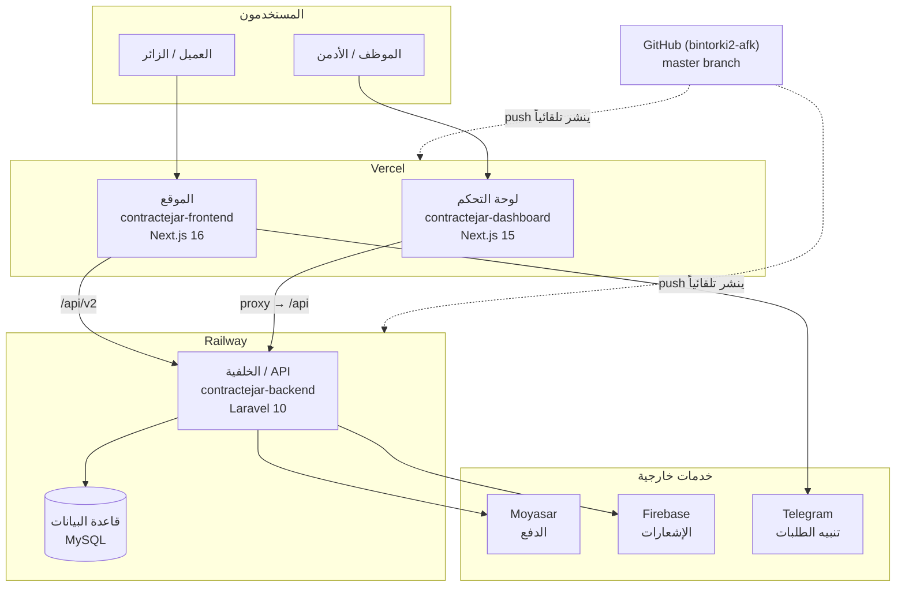
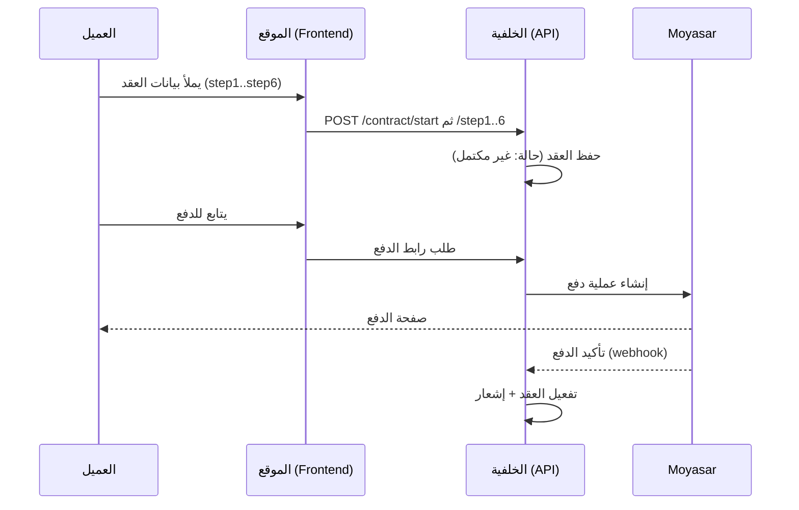

# 🏗️ المخطط المعماري — صقر واحد (contractejar)

> كيف تتكامل مكوّنات المشروع والخدمات الخارجية. آخر تحديث: 2026-10-09

## نظرة عامة

## تدفّق العمل الأساسي (إنشاء عقد)

## قاعدة ظهور الطلبات (دفعة د — ب5) — قاعدة واحدة في كل مكان
| المفهوم | الشرط | أين يظهر |
|---|---|---|
| **طلب** | `is_delete = 0` و `step ≥ 4` (أرسل العميل الصك + العنوان + المالك) — `Contract::scopeAdminListed()` / `reachedAdminOrderStep()` | قائمة «جميع الطلبات» وعدّاداتها (`/orders/status-counts`)، ملف العميل في اللوحة (`orders_count`, `contracts[]`)، قائمة طلبات العميل (`/api/v2/contracts`)، التقارير |
| **مسودة غير مكتملة** | `is_delete = 0` و `step < 4` و `is_completed = 0` — `Contract::scopeIncompleteDraft()` | تبويب «غير مكتمل» فقط (`/orders?tab=incomplete`, `incomplete` في العدّادات، `incomplete_drafts_count` في ملف العميل). لا تظهر للعميل |
| مدفوع / غير مدفوع | `is_completed = 1 / 0` ضمن «طلب» | `paid` / `unpaid` في العدّادات = `completed_orders_count` / `incomplete_orders_count` في ملف العميل |

## مسار حالة الطلب (دفعة د — ب2)
`new → paid → under_review → received_by_employee → whatsapp_draft → ejar_authenticated → completed` — جانبية: `cancelled`, `on_hold`, `refunded`.
- المفتاح الثابت في `contract_statuses.status_key`؛ الكود يبحث بالمفتاح (`ContractStatus::idFor()`) لا بالرقم.
- الدفع الناجح ⇒ «قيد المراجعة» تلقائياً؛ استلام الموظف ⇒ «مستلم من الموظف»؛ «مسترجع» حالة مستقلة (ليست «قيد المراجعة»).
- المنطق في `App\Services\Orders\OrderFlowService`.

## ملاحظات
- **النشر تلقائي بالكامل:** `push` إلى `master` ← Vercel/Railway ينشران دون تدخّل.
- **الموقع** يتصل بالـ API مباشرة عبر `/api/v2`؛ **اللوحة** تمرّر عبر proxy داخلي (`API_PROXY_TARGET`).
- **قاعدة البيانات** مصدر الحقيقة لكل البيانات (عقود، عملاء، مالية) — احرص على نسخها الاحتياطي (راجع `OWNER-GUIDE.md`).
